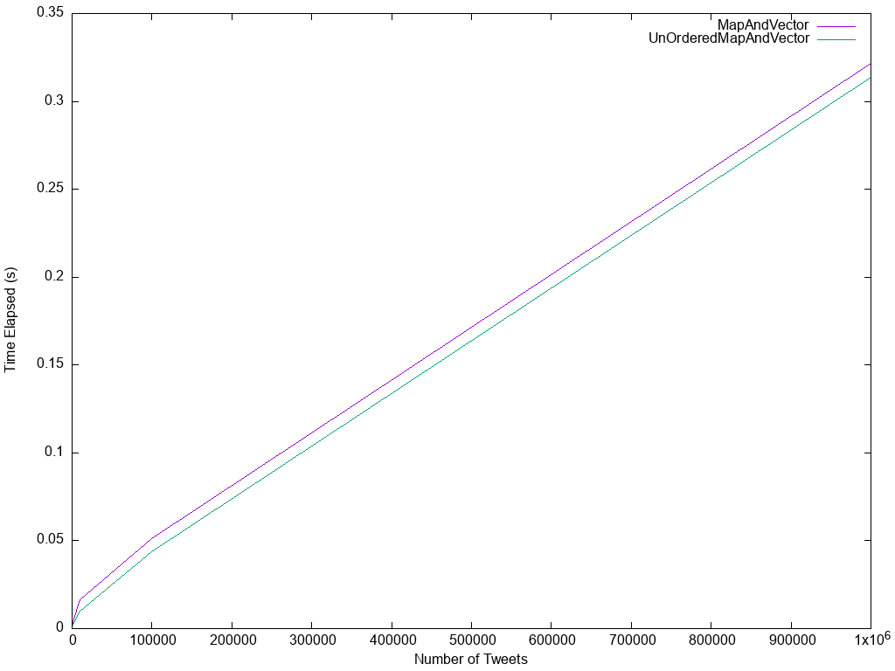

# TweetIt!

Keyword search engine that accepts a text file containing a number of tweets as input (each line is one tweet), and provides a simple user interface for querying the list of tweets against keywords.

# GUI

We used Qt software to create our GUI for this project. The image below shows the view of our GUI. The user can “Browse” and provide a file to read tweets from. Then user can enter a query to “Search” the inverted index. Our GUI also shows the time elapsed for each request at the bottom.

# Timing Analysis to Create Index

The figure below shows the time taken to build the index inverted index when using the unordered_map ​and ​map. ​As expected, the unordered_map allowed the index to be built alot faster, especially as the number of tweets increase.

# Timing Analysis to Search Query

The figure below shows the time taken to search the index inverted index when using the unordered_map ​and ​map. ​Here, the difference is less but still, the unordered_map shows superiority over ordinary map.

# Run the Code

1. Copy the "Without_GUI" folder
2. Run "Makefile"

## To test Map

./MapAndVector abcnews-date-text.csv

## To test Unordered Map

./UnOrderedMapVector abcnews-date-text.csv
